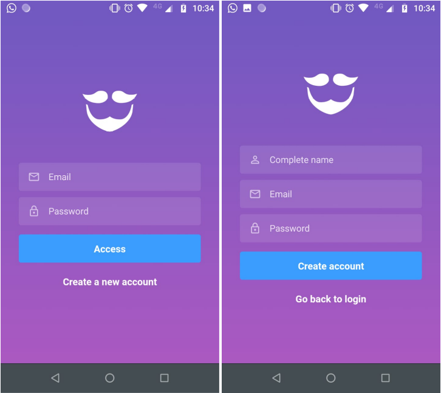
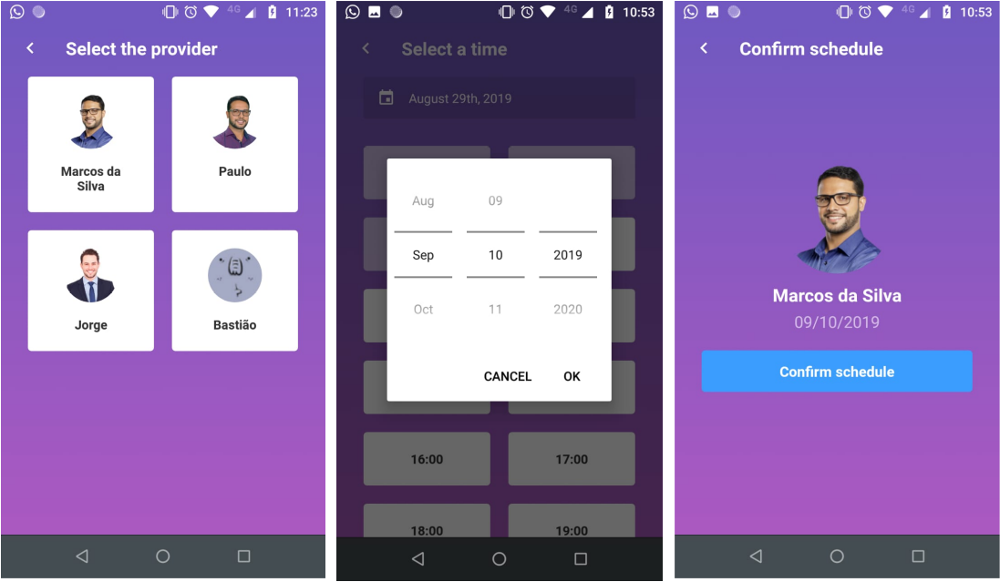
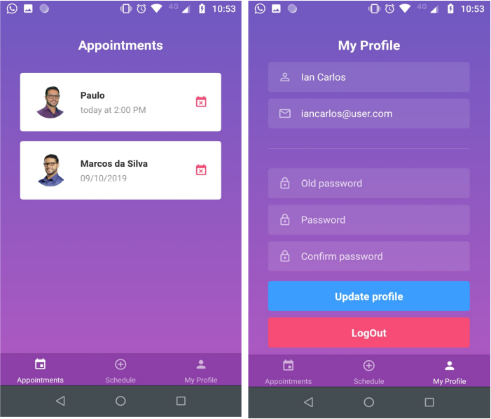

<h2 align="center">
  A barber scheduling app that shows to the barber his agenda for the day.<br/>
  The app is available only to users.
</h2>

<p align="center">
  <a href="#rocket-technologies">Technologies</a>&nbsp;&nbsp;&nbsp;|&nbsp;&nbsp;&nbsp;
  <a href="#information_source-how-to-use">How To Use</a>
</p>
<h3 align="center">Sign In Screen</h3>
<p align="center">

</p>
<h3 align="center">Schedule Screen</h3>
<p align="center">

</p>
<h3 align="center">Dashboard Screen</h3>
<p align="center">

</p>

## :rocket: Technologies

This project was developed at the [RocketSeat GoStack Bootcamp](https://rocketseat.com.br/bootcamp) with the following technologies:

-  [React Native](https://reactnative.dev/)
-  [react-navigation](https://reactnavigation.org/)
-  [Redux](https://redux.js.org/)
-  [Redux-Saga](https://redux-saga.js.org/)
-  [redux-persist](https://github.com/rt2zz/redux-persist)
-  [styled-components](https://www.styled-components.com/)
-  [Axios](https://github.com/axios/axios)
-  [Immer](https://github.com/immerjs/immer)
-  [date-fns](https://date-fns.org/)
-  [react-native-linear-gradient](https://github.com/react-native-community/react-native-linear-gradient)
-  [react-native-vector-icons](https://github.com/oblador/react-native-vector-icons)
-  [react-native-vector-icons](https://github.com/oblador/react-native-vector-icons)
-  [Reactotron](https://infinite.red/reactotron)
-  [reactotron-redux](https://github.com/infinitered/reactotron-redux)
-  [reactotron-redux-saga](https://github.com/infinitered/reactotron-redux-sagan)

## :information_source: How To Use

To clone and run this application, you'll need [Git](https://git-scm.com), [Node](https://nodejs.org/en/) + [Yarn](https://yarnpkg.com/) installed on your computer and the [GoBarber API](hhttps://github.com/rodrigo7331/go-barber-api). 
From your command line:

```bash
# Clone this repository
$ git clone https://github.com/rodrigo7331/gobarber-mobile

# Go into the repository
$ cd gobarber-mobile

# Install dependencies
$ yarn install

# Run the app (iOS)
$ react-native run-ios --simulator="iPhone XS Max"

# Run the app (Android)
$ react-native run-android
```
